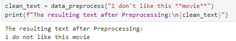
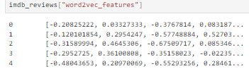
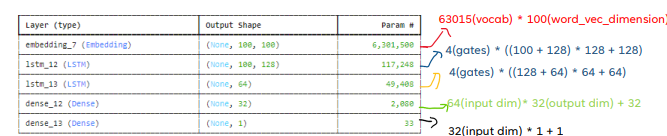
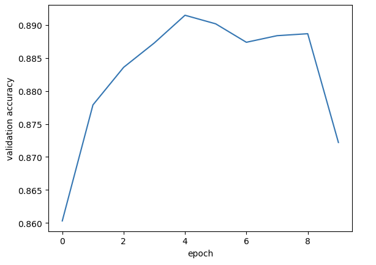
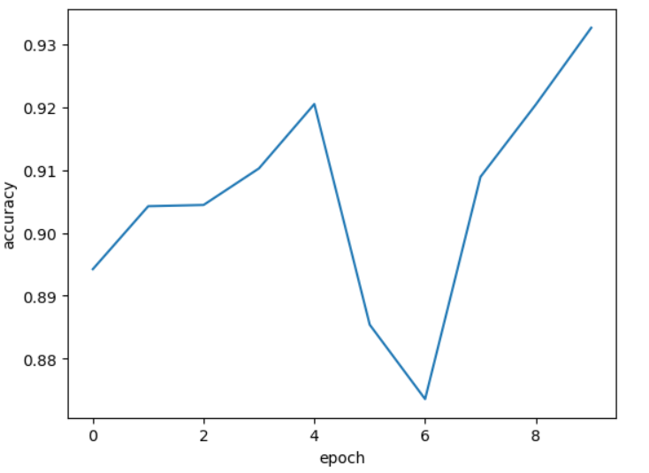

# ADA_SentimentAnalysis
Notebook for the course Advanced Data Analytics

The goal of this project is to compare two different models and their performance when tasked with labeling a movie review as positive or negative. Both models were trained using the imdb review dataset.

**The dataset**: The imdb reviews is a balanced dataset which includes a total of 50.000 reviews labeled as positive or negative.

### Models used
1. TF-IDF with Naive-Bayes [(Model 1 in detail)](#model-1).
2. Word2Vec with LSTM [(Model 2 in detail)](#model-2).

Steps taken to preprocess text data:
1. For Models 1 and 2
* Removing HTML tags using BeautifulSoup
* Remove punctuation
* Convert to lowercase
* Remove double whitespaces
* Remove singular characters(characters surrounded by whitespace)
2. Only for Model 2
* Tokenization
* Remove stopwords(Using the "nltk stopwords" list)

## Model 1
* **TF-IDF**:
It is used to vectorize the vocabulary(all unique words from the training data) and give them a score based on their importance in a review. The score of a term increases when its rare across all documents or when its important for the document(found multiple times). This process will be applied to each term in the vocabulary and the result will be a sparse(mostly 0's) TF-IDF matrix:

_The matrix dimensions are N x M, where N is the number of documents and M is the size of the vocabulary_

* **Naive-Bayes**:
Classifies a document as positive/negative using the scores produced by the TF-IDF process. We make the assumption that each term is independent(naive).
$P(X_i \mid C) = \frac{\text{Sum of TF-IDF scores for term } X_i \text{ in class } C \text{ (positive/negative)}}{\text{Sum of TF-IDF scores for all terms in class } C}, \quad \forall i \in \{1,2,\dots,n\}$
_The conditional probability for a term to belong to a class_
 
The review will be classified in the class for which it has the highest conditional probability:

### Model 1 limitations
The problem with the first model is that it fails to understand word context due to the independence assumption.

## Model 2

* **Word2vec**:
Creates word embeddings which can be represented in vector space, where words used in similar context have similar vectors(the similarity score is given by the cosine similarity). Vectors of 100 features are created and during the training we keep a 5 word context window where the model tries to guess the misssing word based on context(ContinuousBagOfWords).

_For the purpose of context awareness, words that do not show up at least 2 times are removed_

* The deep learning Model used consists of 5 layers:
  * Embedding layer: The shape is (100,100) where each review is padded to have 100 words and each word is represented as a 100-dimensional vector.
  * LSTM layer 1: The first layer has 128 neurons and capturing short term dependencies
  * LSTM layer 2: The second layer takes as input the output of the first LSTM layer which enhances context awareness.
  * Dense layer: Consists of 32 neurons using the ReLU activation function
  * Output layer: One neuron using sigmoid activation function which will map the probability of a review being a certain class.

_Comparing the plots below we can see that when approaching the 8th epoch, validation accuracy decreases dramatically while accuracy increases which indicates overfitting!_

_Thus stopping the training in the 4th epoch_

## Performance
_Based on the last sample_
| Model                | Accuracy | Precision | Recall | F1-score |
|----------------------|----------|-----------|--------|----------|
| TF-IDF + Naïve Bayes | 86%      | 86%       | 86%    | 86%      |
| Word2Vec + LSTM      | 88%      | 88%       | 88%    | 88%      |

_The per-class metrics differ on different runs but since the dataset is large and balanced the results converge on this values_
